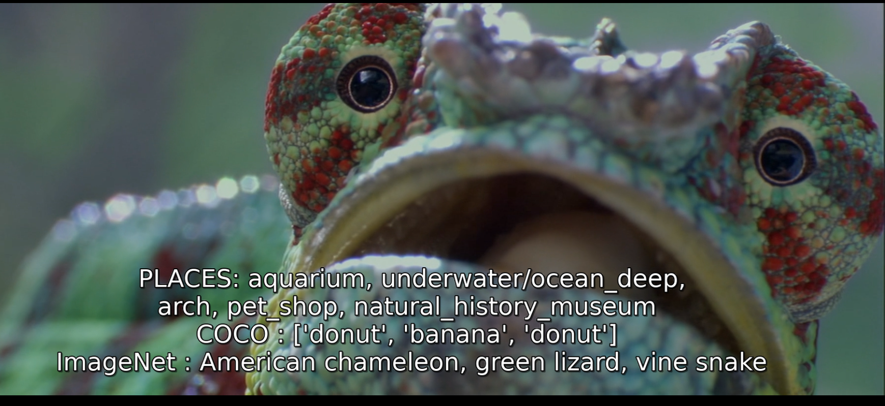

Videoannotation
--

Applying pretrained DL models to annotate videos. 

Used models: 
- [DenseNet161](https://arxiv.org/abs/1608.06993) pretrained on [ImageNet](http://image-net.org/challenges/LSVRC/2012/index)
- [FasterRCNN-ResNet50-FPN](https://arxiv.org/abs/1506.01497) pretrained on [COCO](http://cocodataset.org/#home) 
- [Resnet18](https://arxiv.org/abs/1512.03385) pretrained on [Places365](http://places2.csail.mit.edu/)

Requirements
--
[pytorch](https://pytorch.org/) 1.4.0

[torchvision](https://pytorch.org/docs/stable/torchvision/index.html) 0.5.0  (in particular, the [read_video](https://pytorch.org/docs/stable/torchvision/io.html#torchvision.io.read_video) function needs the pts_unit argument)

[pyAV](https://github.com/mikeboers/PyAV#installation)

Usage
--
    python run_generate_srt.py video.mkv

This will generate a srt file with the same name as the video file. 

Currently runs on the first 10 minutes of the video, annotating one frame every three seconds, and generates a subtitle that lasts 2 seconds.

By default, the code runs on CPU and uses about 12 Gb of RAM because the three models are instantiated in parallel. It can easily be modified to run on GPU.

Credits
--
Nicolas Farrugia, IMT Atlantique, 2020. 
Code for Places365CNN from [Bolei Zhou](https://github.com/CSAILVision/places365).